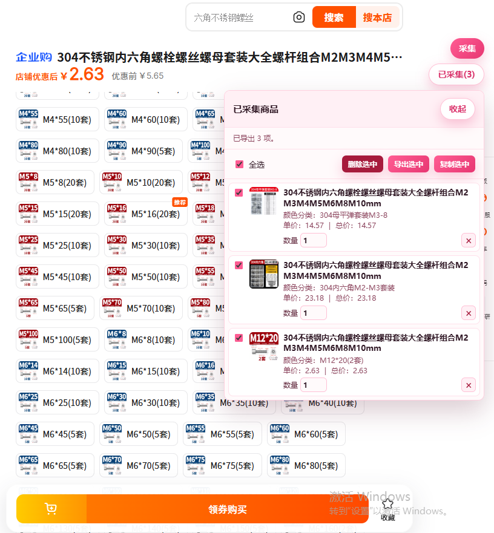
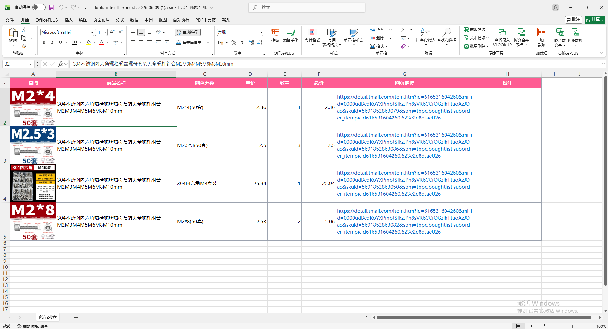

# Taobao/Tmall Product Exporter Demo

这是一个最快可运行的 Chrome 浏览器插件 demo，用来读取当前淘宝或天猫商品页，并导出 `.xlsx` 文件。

## 功能

- 读取当前选中的淘宝或天猫商品页。
- 在淘宝或天猫页面右上角显示粉色「采集」按钮。
- 通过「已采集」面板查看本地采集列表。
- 支持多次采集，并对采集列表批量选中、删除、复制、导出。
- 自动提取首图、商品名称、颜色分类、单价、网页链接。
- 手动填写数量和备注。
- 自动计算总价。
- 导出字段：首图、商品名称、颜色分类、单价、数量、总价、网页链接、备注。
- 下载首图并嵌入 Excel 单元格，不依赖远程图片链接。
- 表头高亮，内容区域添加细边框。
- 网页链接列写入 Excel 原生超链接，可直接点击打开。

## 安装运行

### 开发版

1. 打开 Chrome，进入 `chrome://extensions/`。
2. 打开右上角「开发者模式」。
3. 点击「加载已解压的扩展程序」。
4. 选择当前文件夹：`/mnt/hgfs/05code/TM_Scraper`。
5. 打开一个淘宝或天猫商品详情页。
6. 页面右上角会显示粉色「采集」按钮。
7. 点击「采集」保存当前商品。
8. 点击「已采集」打开采集列表，可批量选中、删除或导出。

### 发布版

修改源码后执行：

```bash
npm run build
```

构建产物会生成到 `dist/`。发布、上传商店或本地测试发布版时，选择目录：

```text
/mnt/hgfs/05code/TM_Scraper/dist
```



浏览器扩展工具栏中的 popup 仍保留单页读取和单项导出能力。

## 文件结构

```text
TM_Scraper/
├── manifest.json                         # 开发版 Chrome MV3 插件配置
├── package.json                          # npm 构建命令和依赖声明
├── package-lock.json                     # npm 依赖版本锁定
├── scripts/
│   └── build.mjs                         # 生成 dist 发布目录
├── src/
│   ├── common/
│   │   └── excel.js                      # 生成带图片、边框、超链接的 `.xlsx` 工作簿
│   ├── content/
│   │   ├── content.js                    # 内容脚本启动入口，初始化页面控件并注册消息监听
│   │   ├── product-extractor.js          # 淘宝/天猫商品信息提取
│   │   ├── collection-store.js           # 已采集商品的本地存储、数量和总价计算
│   │   ├── collector-widget.js           # 页面右上角采集按钮和已采集列表
│   │   └── clipboard.js                  # 复制选中商品、复制单张首图和页面内下载辅助
│   ├── popup/
│   │   ├── popup.html                    # 浏览器工具栏 popup 页面
│   │   ├── popup.js                      # popup 单项读取和导出逻辑
│   │   ├── popup-content-script-files.js # 开发版 popup 兜底注入文件列表
│   │   └── styles.css                    # popup 样式
│   └── entries/
│       ├── content-entry.js              # esbuild content bundle 入口
│       ├── popup-entry.js                # esbuild popup bundle 入口
│       └── popup-content-script-files.prod.js # 发布版 popup 兜底注入文件列表
├── dist/                                 # `npm run build` 生成的发布目录
└── README.md                             # 使用说明和项目结构
```

开发版的 `manifest.json` 按顺序加载 `src/common/` 和 `src/content/` 下的源码模块。发布版由 esbuild 生成，`dist/manifest.json` 只加载压缩后的 `content.js` 和 `popup.js`。

## Demo 取舍

为了最快完成 demo，当前直接在浏览器插件里生成最小 `.xlsx` 文件。发布版使用 esbuild 将源码合并、压缩到 `dist/`，避免发布包直接暴露原始源码文件。

首图会先下载并转换为 PNG 后嵌入工作簿。若图片域名权限或图片下载失败，对应行会导出无图片版本并保留其他字段。

采集数据保存在 `chrome.storage.local`，刷新页面后仍可继续查看和导出。

淘宝和天猫页面结构会变化，当前 `src/content/product-extractor.js` 使用多组选择器和页面 meta、脚本数据兜底。真实使用前，需要用几个目标商品页测试并微调选择器。
